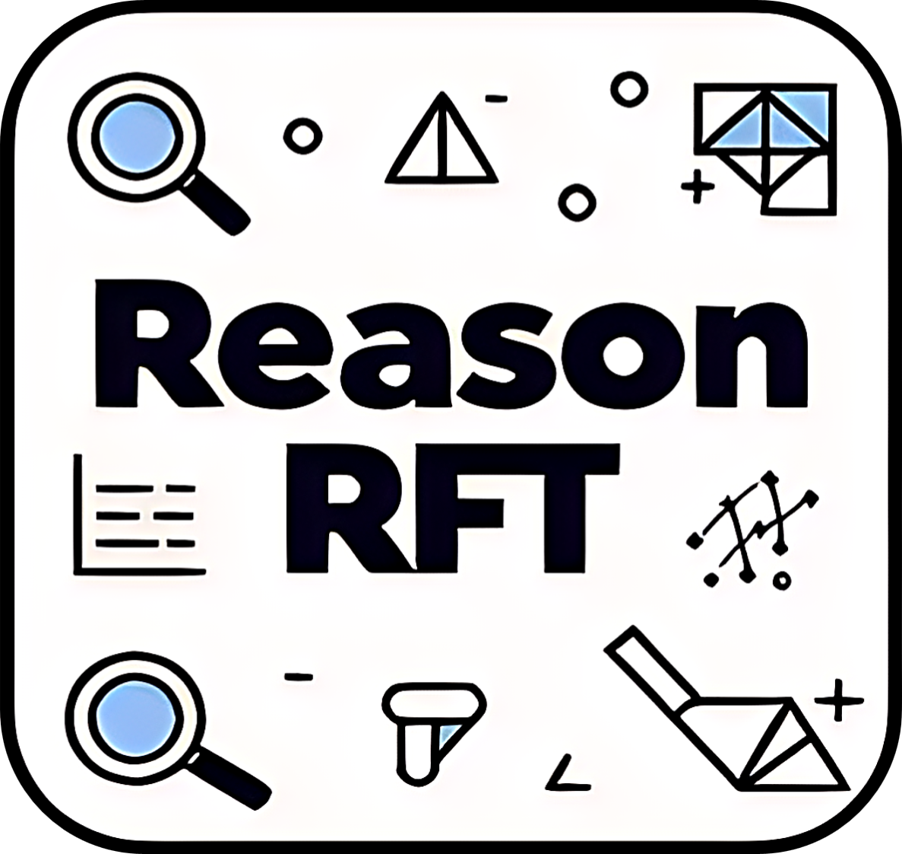

<div align="center">

</div>

# Reason-RFT: Reinforcement Fine-Tuning for Visual Reasoning.

<p align="center">
        </a>&nbsp&nbsp⭐️ <a href="https://tanhuajie.github.io/ReasonRFT/">Project</a></a>&nbsp&nbsp | &nbsp&nbsp🤗 <a href="">Hugging Face</a>&nbsp&nbsp | &nbsp&nbsp🌎 <a href="">Dataset</a>&nbsp&nbsp | &nbsp&nbsp📑 <a href="https://arxiv.org/abs/2503.20752">ArXiv</a>&nbsp&nbsp | &nbsp&nbsp💬 <a href="./assets/wechat.png">WeChat</a>
</p>

<p align="center">
</a>&nbsp&nbsp🤖 <a href="https://github.com/FlagOpen/RoboBrain/">RoboBrain</a>: Aim to Explore ReasonRFT Paradigm to Enhance RoboBrain's Embodied Reasoning Capabilities.
</p>

## 🔥 Overview
Visual reasoning abilities play a crucial role in understanding complex multimodal data, advancing both domain-specific applications and artificial general intelligence (AGI).
Existing methods improve VLM reasoning via Chain-of-Thought (CoT) supervised fine-tuning, using meticulously annotated training data to enhance visual reasoning capabilities.
However, this training paradigm may lead to overfitting and cognitive rigidity, restricting the model's ability to transfer visual reasoning skills across domains and limiting its real-world applicability.
To address these limitations, we propose **Reason-RFT**, a novel reinforcement fine-tuning framework that significantly enhances generalization capabilities in visual reasoning tasks.
**Reason-RFT** introduces a two-phase training framework for visual reasoning: (1) Supervised Fine-Tuning (SFT) with curated Chain-of-Thought (CoT) data activates the reasoning potential of Vision-Language Models (VLMs), followed by (2) Group Relative Policy Optimization (GRPO)-based reinforcement learning that generates multiple reasoning-response pairs, significantly enhancing generalization in visual reasoning tasks.
To evaluate **Reason-RFT**'s visual reasoning capabilities, we reconstructed a comprehensive dataset spanning visual counting, structure perception, and spatial transformation, serving as a benchmark to systematically assess visual cognition, geometric understanding, and spatial generalization.
Experimental results demonstrate Reasoning-RFT's three key advantages: **(1) Performance Enhancement**: achieving state-of-the-art results across multiple tasks, outperforming most mainstream open-source and proprietary models; 
**(2) Generalization Superiority**: consistently maintaining robust performance across diverse tasks and domains, outperforming alternative training paradigms; 
**(3) Data Efficiency**: excelling in few-shot learning scenarios while surpassing full-dataset SFT baselines; 
**Reason-RFT** introduces a novel paradigm in visual reasoning, significantly advancing multimodal research.

<div align="center">

</div>

## <a id="RoadMap"> 🎯 RoadMap</a>

- **`Support different VLMs`**: [RoboBrain](https://github.com/FlagOpen/RoboBrain/), [Qwen2-VL series](https://github.com/QwenLM/Qwen2.5-VL/), [Llava-VL series](https://github.com/LLaVA-VL/LLaVA-NeXT).
    - Explore an efficient training paradigm to enhance [RoboBrain](https://github.com/FlagOpen/RoboBrain/)'s embodied reasoning capabilities.
- **`Support General Visual Reasoning Tasks`**: 
    - Data generation and preparation: Please refer to [General Visual Reasoning Tasks](#GeneralVisualTasks).
    - Training and evaluating for **Visual Counting**: Please refer to [Visual Counting Section](#GeneralVisualTasks).
    - Training and evaluating for **Struction Perception**: Please refer to [Struction Perception Section](#GeneralVisualTasks).
    - Training and evaluating for **Spatial Transformation**: Please refer to [Spatial Transformation Section](#GeneralVisualTasks).
- **`Support Embodied Visual Reasoning Tasks`**: 
    - Data generation and preparation: Please refer to [Embodied Visual Reasoning Tasks](#EmbodiedVisualReasoningTasks).
    - Training and evaluating for **Embodied Planning**: Please refer to [Embodied Planning Section](#EmbodiedVisualReasoningTasks).
    - Training and evaluating for **Embodied Affordance**: Please refer to [Embodied Affordance Section](#EmbodiedVisualReasoningTasks).
    - Training and evaluating for **Embodied Trajectory**: Please refer to [Embodied Trajectory Section](#EmbodiedVisualReasoningTasks).
- **`Support HF/VLLM Inference`**: Please see [Inference Section](#Inference) for detail.


## 🗞️ News

- **`2025-04-02`**: 🔥 We released codes and scripts for training/evaluation on [General Visual Reasoning Tasks](#GeneralVisualTasks).
- **`2025-03-29`**: 🌍 We released the [repository](https://github.com/tanhuajie/Reason-RFT/) and [roadmap](#RoadMap) for **Reason-RFT**.
- **`2025-03-26`**: 📑 We released our initial [ArXiv paper](https://arxiv.org/abs/2503.20752/) of **Reason-RFT**.


## <a id="Method">⭐️ Pipeline</a>

<div align="center">

</div>


## <a id="GeneralVisualTasks"> 🎲 General Visual Reasoning Tasks</a>

### 🛠️ Setup

```bash
# clone repo.
git clone https://github.com/tanhuajie/Reason-RFT.git
cd Reason-RFT

# build conda env.
conda create -n reasonrft python=3.10
conda activate reasonrft
pip install -r requirements.txt
```

### <a id="Preparation"> ♣️ Dataset Preparation</a>
**The training dataset and evaluation benchmarks will be available in the coming days (Uploading Now🤗)**

### <a id="Training"> 📚 Training</a>

```bash
# ANS-SFT, Task1 (Visual-Counting), Qwen2-vl-2b
bash scripts/train/ans_sft/resume_finetune_qwen2vl_2b_task1_ans_sft.sh

# ANS-SFT, Task1 (Visual-Counting), Qwen2-vl-7b
bash scripts/train/ans_sft/resume_finetune_qwen2vl_7b_task1_ans_sft.sh

# ANS-SFT, Task2 (Structure-Perception), Qwen2-vl-2b
bash scripts/train/ans_sft/resume_finetune_qwen2vl_2b_task2_ans_sft.sh

# ANS-SFT, Task2 (Structure-Perception), Qwen2-vl-7b
bash scripts/train/ans_sft/resume_finetune_qwen2vl_7b_task2_ans_sft.sh

# ANS-SFT, Task3 (Spatial-Transformation), Qwen2-vl-2b
bash scripts/train/ans_sft/resume_finetune_qwen2vl_2b_task3_ans_sft.sh

# ANS-SFT, Task3 (Spatial-Transformation), Qwen2-vl-7b
bash scripts/train/ans_sft/resume_finetune_qwen2vl_7b_task3_ans_sft.sh
```

```bash
# COT-SFT, Task1 (Visual-Counting), Qwen2-vl-2b
bash scripts/train/cot_sft/resume_finetune_qwen2vl_2b_task1_cot_sft.sh

# COT-SFT, Task1 (Visual-Counting), Qwen2-vl-7b
bash scripts/train/cot_sft/resume_finetune_qwen2vl_7b_task1_cot_sft.sh

# COT-SFT, Task2 (Structure-Perception), Qwen2-vl-2b
bash scripts/train/cot_sft/resume_finetune_qwen2vl_2b_task2_cot_sft.sh

# COT-SFT, Task2 (Structure-Perception), Qwen2-vl-7b
bash scripts/train/cot_sft/resume_finetune_qwen2vl_7b_task2_cot_sft.sh

# COT-SFT, Task3 (Spatial-Transformation), Qwen2-vl-2b
bash scripts/train/cot_sft/resume_finetune_qwen2vl_2b_task3_cot_sft.sh

# COT-SFT, Task3 (Spatial-Transformation), Qwen2-vl-7b
bash scripts/train/cot_sft/resume_finetune_qwen2vl_7b_task3_cot_sft.sh
```

```bash
# Reason-RFT-Zero, Task1 (Visual-Counting), Qwen2-vl-2b
bash scripts/train/reason_rft_zero/resume_finetune_qwen2vl_2b_task1_only_rl.sh

# Reason-RFT-Zero, Task1 (Visual-Counting), Qwen2-vl-7b
bash scripts/train/reason_rft_zero/resume_finetune_qwen2vl_7b_task1_only_rl.sh

# Reason-RFT-Zero, Task2 (Structure-Perception), Qwen2-vl-2b
bash scripts/train/reason_rft_zero/resume_finetune_qwen2vl_2b_task2_only_rl.sh

# Reason-RFT-Zero, Task2 (Structure-Perception), Qwen2-vl-7b
bash scripts/train/reason_rft_zero/resume_finetune_qwen2vl_7b_task2_only_rl.sh

# Reason-RFT-Zero, Task3 (Spatial-Transformation), Qwen2-vl-2b
bash scripts/train/reason_rft_zero/resume_finetune_qwen2vl_2b_task3_only_rl.sh

# Reason-RFT-Zero, Task3 (Spatial-Transformation), Qwen2-vl-7b
bash scripts/train/reason_rft_zero/resume_finetune_qwen2vl_7b_task3_only_rl.sh
```

```bash
# Reason-RFT, Task1 (Visual-Counting), Qwen2-vl-2b, STAGE1 + STAGE2
bash scripts/train/reason_rft/stage_sft/resume_finetune_qwen2vl_2b_task1_stage1_sft.sh
bash scripts/train/reason_rft/stage_rl/resume_finetune_qwen2vl_2b_task1_stage2_rl.sh

# Reason-RFT, Task1 (Visual-Counting), Qwen2-vl-7b, STAGE1 + STAGE2
bash scripts/train/reason_rft/stage_sft/resume_finetune_qwen2vl_7b_task1_stage1_sft.sh
bash scripts/train/reason_rft/stage_rl/resume_finetune_qwen2vl_7b_task1_stage2_rl.sh

# Reason-RFT, Task2 (Structure-Perception), Qwen2-vl-2b, STAGE1 + STAGE2
bash scripts/train/reason_rft/stage_sft/resume_finetune_qwen2vl_2b_task2_stage1_sft.sh
bash scripts/train/reason_rft/stage_rl/resume_finetune_qwen2vl_2b_task2_stage2_rl.sh

# Reason-RFT, Task2 (Structure-Perception), Qwen2-vl-7b, STAGE1 + STAGE2
bash scripts/train/reason_rft/stage_sft/resume_finetune_qwen2vl_7b_task2_stage1_sft.sh
bash scripts/train/reason_rft/stage_rl/resume_finetune_qwen2vl_7b_task2_stage2_rl.sh

# Reason-RFT, Task3 (Spatial-Transformation), Qwen2-vl-2b, STAGE1 + STAGE2
bash scripts/train/reason_rft/stage_sft/resume_finetune_qwen2vl_2b_task3_stage1_sft.sh
bash scripts/train/reason_rft/stage_rl/resume_finetune_qwen2vl_2b_task3_stage2_rl.sh

# Reason-RFT, Task3 (Spatial-Transformation), Qwen2-vl-7b, STAGE1 + STAGE2
bash scripts/train/reason_rft/stage_sft/resume_finetune_qwen2vl_7b_task3_stage1_sft.sh
bash scripts/train/reason_rft/stage_rl/resume_finetune_qwen2vl_7b_task3_stage2_rl.sh
```
**Note:** Please change the dataset, pre-trained model and image path in the scripts above.

## <a id="Evaluation"> 🔭 Evaluation</a>
```bash
# Evaluating and get scores for Proprietary Models (GPT4o, Gemini)
bash scripts/eval/close_source_models/evaluate_gemini.sh
bash scripts/eval/close_source_models/evaluate_gpt4o.sh

# Only get scores for Proprietary Models (GPT4o, Gemini), since you have already evaluated them before
bash scripts/eval/close_source_models/evaluate_gemini_only_calculate_score.sh
bash scripts/eval/close_source_models/evaluate_gpt4o_only_calculate_score.sh

# Evaluating with single GPU for ours or Open-Source Models
bash scripts/eval/open_source_models/single_gpu_eval/eval_by_vllm_all_tasks_zero_shot_single_gpu.sh
bash scripts/eval/open_source_models/single_gpu_eval/eval_by_vllm_all_tasks_ans_sft_single_gpu.sh
bash scripts/eval/open_source_models/single_gpu_eval/eval_by_vllm_all_tasks_cot_sft_single_gpu.sh
bash scripts/eval/open_source_models/single_gpu_eval/eval_by_vllm_all_tasks_reason_rft_single_gpu.sh

# Evaluating with multiple GPUs for ours or Open-Source Models
bash scripts/eval/open_source_models/multi_gpu_eval/eval_by_vllm_all_tasks_zero_shot_multi_gpu.sh
bash scripts/eval/open_source_models/multi_gpu_eval/eval_by_vllm_all_tasks_ans_sft_multi_gpu.sh
bash scripts/eval/open_source_models/multi_gpu_eval/eval_by_vllm_all_tasks_cot_sft_multi_gpu.sh
bash scripts/eval/open_source_models/multi_gpu_eval/eval_by_vllm_all_tasks_reason_rft_multi_gpu.sh

# Get scores for ours or Open-Source Models
bash scripts/eval/open_source_models/calculate_score/calculate_score.sh
```
**Note:** Please change the checkpoint path in the scripts above.

## <a id="EmbodiedVisualReasoningTasks"> 🤖 Embodied Visual Reasoning Tasks</a>
***Please Stay Tuned ...***


## 📑 Citation
If you find this project useful, welcome to cite us.
```bib
@article{tan2025reasonrft,
    title={Reason-RFT: Reinforcement Fine-Tuning for Visual Reasoning}, 
    author={Huajie Tan and Yuheng Ji and Xiaoshuai Hao and Minglan Lin and Pengwei Wang and Zhongyuan Wang and Shanghang Zhang},
    journal={arXiv preprint arXiv:2503.20752},
    year={2025}
}
```
