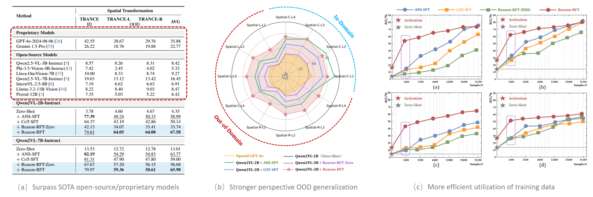
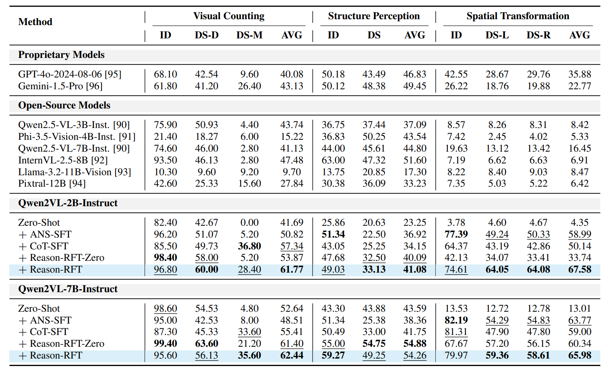

<div align="center">

</div>

# Reason-RFT
**Reason-RFT: Reinforcement Fine-Tuning for Visual Reasoning.**

<p align="center">
    </a>&nbsp&nbsp⭐️ <a href="https://tanhuajie.github.io/ReasonRFT/">Project</a></a>&nbsp&nbsp │ &nbsp&nbsp🌎 <a href="https://huggingface.co/datasets/tanhuajie2001/Reason-RFT-CoT-Dataset">Dataset</a>&nbsp&nbsp │ &nbsp&nbsp🤗 <a href="https://github.com/tanhuajie/Reason-RFT?tab=readme-ov-file#--model-zoo">Models</a>&nbsp&nbsp │ &nbsp&nbsp📑 <a href="https://arxiv.org/abs/2503.20752">ArXiv</a>&nbsp&nbsp │ &nbsp&nbsp💬 <a href="./assets/wechat.png">WeChat</a>
</p>

<p align="center">
</a>&nbsp&nbsp🤖 <a href="https://github.com/FlagOpen/RoboBrain/">RoboBrain</a>: Aim to Explore ReasonRFT Paradigm to Enhance RoboBrain's Embodied Reasoning Capabilities.
</p>

## 🔥 Overview
Visual reasoning abilities play a crucial role in understanding complex multimodal data, advancing both domain-specific applications and artificial general intelligence (AGI).
Existing methods improve VLM reasoning via Chain-of-Thought (CoT) supervised fine-tuning, using meticulously annotated training data to enhance visual reasoning capabilities.
However, this training paradigm may lead to overfitting and cognitive rigidity, restricting the model's ability to transfer visual reasoning skills across domains and limiting its real-world applicability.
To address these limitations, we propose **Reason-RFT**, a novel reinforcement fine-tuning framework that significantly enhances generalization capabilities in visual reasoning tasks.
**Reason-RFT** introduces a two-phase training framework for visual reasoning: (1) Supervised Fine-Tuning (SFT) with curated Chain-of-Thought (CoT) data activates the reasoning potential of Vision-Language Models (VLMs), followed by (2) Group Relative Policy Optimization (GRPO)-based reinforcement learning that generates multiple reasoning-response pairs, significantly enhancing generalization in visual reasoning tasks.
To evaluate **Reason-RFT**'s visual reasoning capabilities, we reconstructed a comprehensive dataset spanning visual counting, structure perception, and spatial transformation, serving as a benchmark to systematically assess visual cognition, geometric understanding, and spatial generalization.
Experimental results demonstrate Reasoning-RFT's three key advantages: **(1) Performance Enhancement**: achieving state-of-the-art results across multiple tasks, outperforming most mainstream open-source and proprietary models; 
**(2) Generalization Superiority**: consistently maintaining robust performance across diverse tasks and domains, outperforming alternative training paradigms; 
**(3) Data Efficiency**: excelling in few-shot learning scenarios while surpassing full-dataset SFT baselines; 
**Reason-RFT** introduces a novel paradigm in visual reasoning, significantly advancing multimodal research.

<div align="center">

</div>

## <a id="RoadMap"> 🎯 RoadMap</a>

- **`Support different VLMs`**: [RoboBrain](https://github.com/FlagOpen/RoboBrain/), [Qwen2-VL series](https://github.com/QwenLM/Qwen2.5-VL/), [Llava-VL series](https://github.com/LLaVA-VL/LLaVA-NeXT).
    - Explore an efficient training paradigm to enhance [RoboBrain](https://github.com/FlagOpen/RoboBrain/)'s embodied reasoning capabilities.
- **`Support General Visual Reasoning Tasks`**: 
    - Data download and preparation: Please refer to [General Visual Reasoning Tasks](#Preparation).
    - Training and evaluating for **Visual Counting**: Please refer to [Visual Counting Section](#GeneralVisualTasks).
    - Training and evaluating for **Struction Perception**: Please refer to [Struction Perception Section](#GeneralVisualTasks).
    - Training and evaluating for **Spatial Transformation**: Please refer to [Spatial Transformation Section](#GeneralVisualTasks).
- **`Support Embodied Visual Reasoning Tasks`**: 
    - Data generation and preparation: Please refer to [Embodied Visual Reasoning Tasks](#EmbodiedVisualReasoningTasks).
    - Training and evaluating for **Embodied Planning**: Please refer to [Embodied Planning Section](#EmbodiedVisualReasoningTasks).
    - Training and evaluating for **Embodied Affordance**: Please refer to [Embodied Affordance Section](#EmbodiedVisualReasoningTasks).
    - Training and evaluating for **Embodied Trajectory**: Please refer to [Embodied Trajectory Section](#EmbodiedVisualReasoningTasks).
- **`Support HF/VLLM Inference`**: Please see [Inference Section](#Inference) for detail.


## 🗞️ News

- **`2025-04-13`**: ✨ We released our [model zoo](https://github.com/tanhuajie/Reason-RFT?tab=readme-ov-file#--model-zoo) to huggingface.
- **`2025-04-04`**: 🤗 We released our [datasets](https://huggingface.co/datasets/tanhuajie2001/Reason-RFT-CoT-Dataset/) to huggingface for [General Visual Reasoning Tasks](#GeneralVisualTasks).
- **`2025-04-02`**: 🔥 We released codes and scripts for training/evaluation on [General Visual Reasoning Tasks](#GeneralVisualTasks).
- **`2025-03-29`**: 🌍 We released the [repository](https://github.com/tanhuajie/Reason-RFT/) and [roadmap](#RoadMap) for **Reason-RFT**.
- **`2025-03-26`**: 📑 We released our initial [ArXiv paper](https://arxiv.org/abs/2503.20752/) of **Reason-RFT**.


## <a id="Method">⭐️ Pipeline</a>

<div align="center">

</div>


## <a id="ModelCheckpoints"> 🤗 Model Zoo</a>

| Tasks                  | Reason-RFT-Zero-2B        | Reason-RFT-Zero-7B       | Reason-RFT-2B        | Reason-RFT-7B             |
|------------------------|---------------------------|---------------------|---------------------------|---------------------------|
| Visual Counting        | [🤗VC-GRPO-Zero-2B](https://huggingface.co/tanhuajie2001/Reason-RFT-Zero-Visual-Counting-Qwen2-VL-2B) | [🤗VC-GRPO-Zero-7B](https://huggingface.co/tanhuajie2001/Reason-RFT-Zero-Visual-Counting-Qwen2-VL-7B) | [🤗VC-GRPO-2B](https://huggingface.co/tanhuajie2001/Reason-RFT-Visual-Counting-Qwen2-VL-2B) | [🤗VC-GRPO-7B](https://huggingface.co/tanhuajie2001/Reason-RFT-Visual-Counting-Qwen2-VL-7B) |
| Structure Perception   | [🤗SP-GRPO-Zero-2B](https://huggingface.co/tanhuajie2001/Reason-RFT-Zero-Structure-Perception-Qwen2-VL-2B) | [🤗SP-GRPO-Zero-7B](https://huggingface.co/tanhuajie2001/Reason-RFT-Zero-Structure-Perception-Qwen2-VL-7B) | [🤗SP-GRPO-2B](https://huggingface.co/tanhuajie2001/Reason-RFT-Structure-Perception-Qwen2-VL-2B) | [🤗SP-GRPO-7B](https://huggingface.co/tanhuajie2001/Reason-RFT-Structure-Perception-Qwen2-VL-7B) |
| Spatial Transformation | [🤗ST-GRPO-Zero-2B](https://huggingface.co/tanhuajie2001/Reason-RFT-Zero-Spatial-Transformation-Qwen2-VL-2B) | [🤗ST-GRPO-Zero-7B](https://huggingface.co/tanhuajie2001/Reason-RFT-Zero-Spatial-Transformation-Qwen2-VL-7B) | [🤗ST-GRPO-2B](https://huggingface.co/tanhuajie2001/Reason-RFT-Spatial-Transformation-Qwen2-VL-2B) | [🤗ST-GRPO-7B](https://huggingface.co/tanhuajie2001/Reason-RFT-Spatial-Transformation-Qwen2-VL-7B) | 
| ***Embodied Tasks***   | 🤖 *Stay Turned*   | 🤖 *Stay Turned*   | 🤖 *Stay Turned*   | 🤖 *Stay Turned*  | 


## <a id="GeneralVisualTasks"> 🎲 General Visual Reasoning Tasks</a>

### 🛠️ Setup

```bash
# clone repo.
git clone https://github.com/tanhuajie/Reason-RFT.git
cd Reason-RFT

# build conda env. for stage_rl
conda create -n reasonrft_rl python=3.10
conda activate reasonrft_rl
pip install -r requirements_rl.txt

# build conda env. for stage_sft
conda create -n reasonrft_sft python=3.10
conda activate reasonrft_sft
pip install -r requirements_sft.txt
```

### <a id="Preparation"> ♣️ Dataset Preparation</a>

#### Step 1: Download Dataset
```bash
# Download from tanhuajie2001/Reason-RFT-CoT-Dataset
huggingface-cli download --repo-type dataset --resume-download tanhuajie2001/Reason-RFT-CoT-Dataset --local-dir ./Reason-RFT-CoT-Dataset

# unzip images
cd Reason-RFT-CoT-Dataset
unzip train_images.zip
unzip test_images.zip
```

Then, your local directory should be like:

```bash
Reason-RFT-CoT-Dataset/
│   # Images for training & evaluation
├── images/
│   ├── train_images/
│   │   ├── ...
│   └── test_images/
│       ├── ...
│   # CoT datasets for training
├── train_jsons/
│   │   # Full datasets for Spatial-Transformation task
│   ├── A1-Spatial-Transformation-train-60k-cot.json
│   │   # Full datasets for Structure-Perception task
│   ├── A2-Structure-Perception-train-4k5-cot.json
│   │   # Full datasets for Visual-Counting task
│   ├── A3-Visual-Counting-train-35k-cot.json
│   │   # Scientific visual reasoning (Optional for extensive/ablation exp.)
│   ├── AI2D-train-1467-cot.json
│   ├── ScienceQA-train-2112-cot.json
│   │   # Topological visual reasoning (Optional for extensive/ablation exp.)
│   ├── GVLQA-connectivity-train-1199-cot.json
│   ├── GVLQA-cycle-train-1194-cot.json
│   ├── GVLQA-hamilton-train-1158-cot.json
│   ├── GVLQA-topology-train-1070-cot.json
│   ├── GVLQA-matching-train-1193-cot.json
│   │   # Pattern & Puzzle visual reasoning (Optional for extensive/ablation exp.)
│   ├── PuzzleVQA-train-1618-cot.json
│   ├── IconQA-train-5270-cot.json
│   ├── Raven-train-982-cot.json
│   │   # Geometric visual reasoning (Optional for extensive/ablation exp.)
│   ├── GeoQA-train-1500-cot.json
│   ├── GeomVerse-train-2841-cot.json
│   └── Geometry3K-train-3794-cot.json
│   # Datasets for evaluation
├── test_jsons/
│   │   # Evaluation for Spatial-Transformation task
│   ├── Spatial-Transformation-id-test-1k.json # In-Domain
│   ├── Spatial-Transformation-ood-left-test-1k.json # Out-of-Domain
│   ├── Spatial-Transformation-ood-right-test-1k.json # Out-of-Domain
│   │   # Evaluation for Structure-Perception task
│   ├── Structure-Perception-id-test-820.json # In-Domain
│   ├── Structure-Perception-ood-test-800.json # Out-of-Domain
│   │   # Evaluation for Visual-Counting task
│   ├── Visual-Counting-id-test-1k.json # In-Domain
│   └── Visual-Counting-ood-test-1k.json # Out-of-Domain
└── README.md
```

#### Step 2: Construct Dataset for ANS-SFT, COT-SFT, Reason-RFT(-Zero)

*Note:* If you want to implement training process for our three main tasks, only three Meta-Json files -- **'A1-Spatial-Transformation-train-60k-cot.json', 'A2-Structure-Perception-train-4k5-cot.json' and 'A3-Visual-Counting-train-35k-cot.json'** -- are needed respectively. Then, all the training-used json files can be constructed by these three Meta-Json files above. At this step, you should write the simple scripts to complete the construction for **your own training-used json files** directly, according to the sample format as shown below.

**📑 1. For *ANS-SFT* training, we use ShareGPT format to refactor each sample:**

```json
{
    "id": "{id}",
    "image": "{image}",
    "messages": [
        {
            "content": "{PROMPT_xxx_ANS_SFT} + <image> + {problem}",
            "role": "user"
        },
        {
            "content": "{answer}",
            "role": "assistant"
        }
    ]
},
```
```
Tips: {Prompt_xxx_ANS_SFT} can be found in ./utils/prompts.py, while {id}, {image}, {problem} and {answer} are from Meta-Json files.
```

**📑 2. For *COT-SFT* training, we also use ShareGPT format to refactor each sample:**

```json
{
    "id": "{id}",
    "image": "{image}",
    "messages": [
        {
            "content": "{PROMPT_xxx_COT_SFT} + <image> + {problem}",
            "role": "user"
        },
        {
            "content": "<think>\n{cot}\n</think>\n<answer>\n{answer}\n</answer>",
            "role": "assistant"
        }
    ]
},
```
```
Tips: {Prompt_xxx_COT_SFT} can be found in ./utils/prompts.py, while {id}, {image}, {problem}, {cot} and {answer} are from Meta-Json files.

Note: when refactor 'Structure Perception' task, {Prompt_xxx_COT_SFT} can be devided into 'PROMPT_STRUCTURE_PERCEPTION_CHOICE_COT_SFT' and 'PROMPT_STRUCTURE_PERCEPTION_NON_CHOICE_COT_SFT'. If 'A' or 'B' or 'C' or 'D' in {answer}, we use 'PROMPT_STRUCTURE_PERCEPTION_CHOICE_COT_SFT', otherwise, we use 'PROMPT_STRUCTURE_PERCEPTION_NON_CHOICE_COT_SFT'.
```

**📑 3. For *Reason-RFT-Zero* training, we use RL format below to refactor each sample:**

```json
{
    "id": "{id}",
    "image": "{image}",
    "problem": "{problem}",
    "solution": "{answer}"
},
```
```
Tips: {id}, {image}, {problem} and {answer} are from Meta-Json files.
```

**📑 4. For *Reason-RFT* training, we use COT-SFT format to refactor 1.6k samples for STAGE-1, and use RL format to refactor the rest samples or full samples for STAGE-2.**

 *Specifically, in STAGE 2, we refactor full samples for Structure-Perception task due to its too limited training samples (only 4.5k), while we refactor only the rest samples for Spatial-Transformation task and Visual-Counting task.*


#### Step 3: Change Path to Your Own Constructed Datasets
```bash
# SFT Training: 
change dataset paths defined in './train/stage_sft/dataset_info.json' file.

# RL Training: 
change dataset paths defined in './scripts/train/reason_rft/stage_rl/xxx.bash' file.
change dataset paths defined in './scripts/train/reason_rft_zero/xxx.bash' file.

# Evaluation: 
change dataset paths defined in './eval/eval_by_vllm_for_open_source.py' file.
```

### <a id="Training"> 📚 Training</a>

```bash
# ANS-SFT, Task1 (Visual-Counting), Qwen2-vl-2b
bash scripts/train/ans_sft/resume_finetune_qwen2vl_2b_task1_ans_sft.sh

# ANS-SFT, Task1 (Visual-Counting), Qwen2-vl-7b
bash scripts/train/ans_sft/resume_finetune_qwen2vl_7b_task1_ans_sft.sh

# ANS-SFT, Task2 (Structure-Perception), Qwen2-vl-2b
bash scripts/train/ans_sft/resume_finetune_qwen2vl_2b_task2_ans_sft.sh

# ANS-SFT, Task2 (Structure-Perception), Qwen2-vl-7b
bash scripts/train/ans_sft/resume_finetune_qwen2vl_7b_task2_ans_sft.sh

# ANS-SFT, Task3 (Spatial-Transformation), Qwen2-vl-2b
bash scripts/train/ans_sft/resume_finetune_qwen2vl_2b_task3_ans_sft.sh

# ANS-SFT, Task3 (Spatial-Transformation), Qwen2-vl-7b
bash scripts/train/ans_sft/resume_finetune_qwen2vl_7b_task3_ans_sft.sh
```

```bash
# COT-SFT, Task1 (Visual-Counting), Qwen2-vl-2b
bash scripts/train/cot_sft/resume_finetune_qwen2vl_2b_task1_cot_sft.sh

# COT-SFT, Task1 (Visual-Counting), Qwen2-vl-7b
bash scripts/train/cot_sft/resume_finetune_qwen2vl_7b_task1_cot_sft.sh

# COT-SFT, Task2 (Structure-Perception), Qwen2-vl-2b
bash scripts/train/cot_sft/resume_finetune_qwen2vl_2b_task2_cot_sft.sh

# COT-SFT, Task2 (Structure-Perception), Qwen2-vl-7b
bash scripts/train/cot_sft/resume_finetune_qwen2vl_7b_task2_cot_sft.sh

# COT-SFT, Task3 (Spatial-Transformation), Qwen2-vl-2b
bash scripts/train/cot_sft/resume_finetune_qwen2vl_2b_task3_cot_sft.sh

# COT-SFT, Task3 (Spatial-Transformation), Qwen2-vl-7b
bash scripts/train/cot_sft/resume_finetune_qwen2vl_7b_task3_cot_sft.sh
```

```bash
# Reason-RFT-Zero, Task1 (Visual-Counting), Qwen2-vl-2b
bash scripts/train/reason_rft_zero/resume_finetune_qwen2vl_2b_task1_only_rl.sh

# Reason-RFT-Zero, Task1 (Visual-Counting), Qwen2-vl-7b
bash scripts/train/reason_rft_zero/resume_finetune_qwen2vl_7b_task1_only_rl.sh

# Reason-RFT-Zero, Task2 (Structure-Perception), Qwen2-vl-2b
bash scripts/train/reason_rft_zero/resume_finetune_qwen2vl_2b_task2_only_rl.sh

# Reason-RFT-Zero, Task2 (Structure-Perception), Qwen2-vl-7b
bash scripts/train/reason_rft_zero/resume_finetune_qwen2vl_7b_task2_only_rl.sh

# Reason-RFT-Zero, Task3 (Spatial-Transformation), Qwen2-vl-2b
bash scripts/train/reason_rft_zero/resume_finetune_qwen2vl_2b_task3_only_rl.sh

# Reason-RFT-Zero, Task3 (Spatial-Transformation), Qwen2-vl-7b
bash scripts/train/reason_rft_zero/resume_finetune_qwen2vl_7b_task3_only_rl.sh
```

```bash
# Reason-RFT, Task1 (Visual-Counting), Qwen2-vl-2b, STAGE1 + STAGE2
bash scripts/train/reason_rft/stage_sft/resume_finetune_qwen2vl_2b_task1_stage1_sft.sh
bash scripts/train/reason_rft/stage_rl/resume_finetune_qwen2vl_2b_task1_stage2_rl.sh

# Reason-RFT, Task1 (Visual-Counting), Qwen2-vl-7b, STAGE1 + STAGE2
bash scripts/train/reason_rft/stage_sft/resume_finetune_qwen2vl_7b_task1_stage1_sft.sh
bash scripts/train/reason_rft/stage_rl/resume_finetune_qwen2vl_7b_task1_stage2_rl.sh

# Reason-RFT, Task2 (Structure-Perception), Qwen2-vl-2b, STAGE1 + STAGE2
bash scripts/train/reason_rft/stage_sft/resume_finetune_qwen2vl_2b_task2_stage1_sft.sh
bash scripts/train/reason_rft/stage_rl/resume_finetune_qwen2vl_2b_task2_stage2_rl.sh

# Reason-RFT, Task2 (Structure-Perception), Qwen2-vl-7b, STAGE1 + STAGE2
bash scripts/train/reason_rft/stage_sft/resume_finetune_qwen2vl_7b_task2_stage1_sft.sh
bash scripts/train/reason_rft/stage_rl/resume_finetune_qwen2vl_7b_task2_stage2_rl.sh

# Reason-RFT, Task3 (Spatial-Transformation), Qwen2-vl-2b, STAGE1 + STAGE2
bash scripts/train/reason_rft/stage_sft/resume_finetune_qwen2vl_2b_task3_stage1_sft.sh
bash scripts/train/reason_rft/stage_rl/resume_finetune_qwen2vl_2b_task3_stage2_rl.sh

# Reason-RFT, Task3 (Spatial-Transformation), Qwen2-vl-7b, STAGE1 + STAGE2
bash scripts/train/reason_rft/stage_sft/resume_finetune_qwen2vl_7b_task3_stage1_sft.sh
bash scripts/train/reason_rft/stage_rl/resume_finetune_qwen2vl_7b_task3_stage2_rl.sh
```
**Note:** Please change the dataset, pre-trained model and image path in the scripts above.

## <a id="Evaluation"> 🔭 Evaluation</a>
```bash
# Evaluating and get scores for Proprietary Models (GPT4o, Gemini)
bash scripts/eval/close_source_models/evaluate_gemini.sh
bash scripts/eval/close_source_models/evaluate_gpt4o.sh

# Only get scores for Proprietary Models (GPT4o, Gemini), since you have already evaluated them before
bash scripts/eval/close_source_models/evaluate_gemini_only_calculate_score.sh
bash scripts/eval/close_source_models/evaluate_gpt4o_only_calculate_score.sh

# Evaluating with single GPU for ours or Open-Source Models
bash scripts/eval/open_source_models/single_gpu_eval/eval_by_vllm_all_tasks_zero_shot_single_gpu.sh
bash scripts/eval/open_source_models/single_gpu_eval/eval_by_vllm_all_tasks_ans_sft_single_gpu.sh
bash scripts/eval/open_source_models/single_gpu_eval/eval_by_vllm_all_tasks_cot_sft_single_gpu.sh
bash scripts/eval/open_source_models/single_gpu_eval/eval_by_vllm_all_tasks_reason_rft_single_gpu.sh

# Evaluating with multiple GPUs for ours or Open-Source Models
bash scripts/eval/open_source_models/multi_gpu_eval/eval_by_vllm_all_tasks_zero_shot_multi_gpu.sh
bash scripts/eval/open_source_models/multi_gpu_eval/eval_by_vllm_all_tasks_ans_sft_multi_gpu.sh
bash scripts/eval/open_source_models/multi_gpu_eval/eval_by_vllm_all_tasks_cot_sft_multi_gpu.sh
bash scripts/eval/open_source_models/multi_gpu_eval/eval_by_vllm_all_tasks_reason_rft_multi_gpu.sh

# Get scores for ours or Open-Source Models
bash scripts/eval/open_source_models/calculate_score/calculate_score.sh
```
**Note:** Please change the checkpoint path in the scripts above.

### <a id="OurResults"> ⭐️ Results in our paper</a>

*1. Results of Spatial Transformation Task:*

<div align="center">

</div>


*2. Full Results of Three Tasks:*

<div align="center">

</div>

*Note: For more detail results, please refer to our [main paper and appendix](https://arxiv.org/abs/2503.20752)*

## <a id="EmbodiedVisualReasoningTasks"> 🤖 Embodied Visual Reasoning Tasks</a>
***Please Stay Tuned ...***


## 📑 Citation
If you find this project useful, welcome to cite us.
```bib
@article{tan2025reason,
  title={Reason-RFT: Reinforcement Fine-Tuning for Visual Reasoning},
  author={Tan, Huajie and Ji, Yuheng and Hao, Xiaoshuai and Lin, Minglan and Wang, Pengwei and Wang, Zhongyuan and Zhang, Shanghang},
  journal={arXiv preprint arXiv:2503.20752},
  year={2025}
}
```
